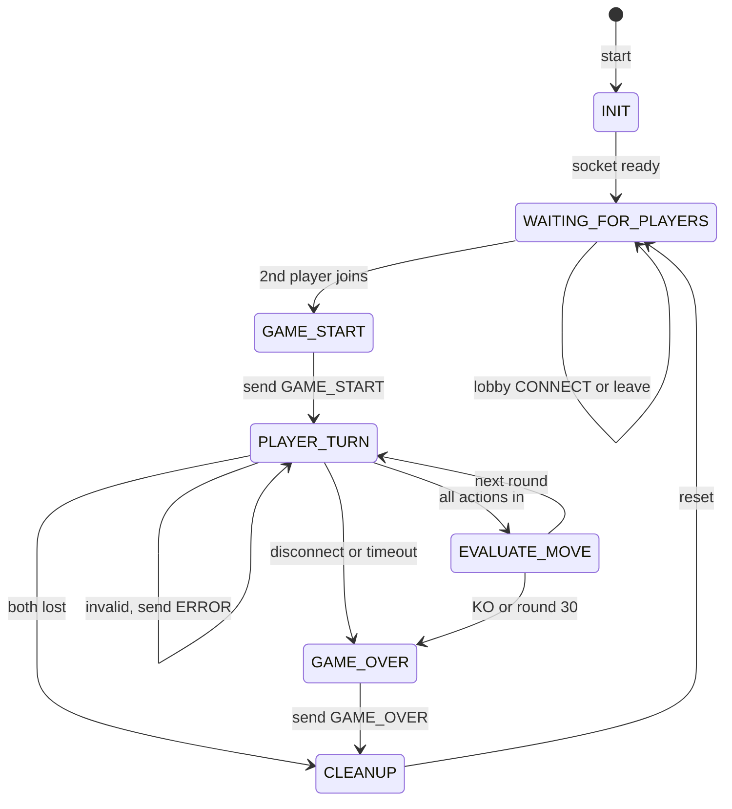
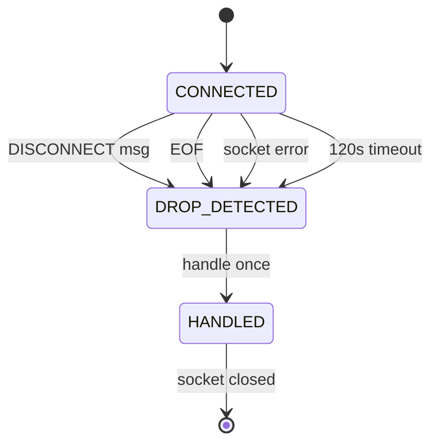

# Knight Duel: Game State Machine (FSM) Specification

**Student:** Makaela Maryanski  
**Course:** CS 457  
**Date:** September 30, 2026

This document describes the server-side state machine for Knight Duel. It uses the messages, error codes, and rules from `protocol_blueprint.md`. The server runs one match at a time, and it is the only thing that changes the game state. Clients only send `MOVE`, `CONNECT`, and `DISCONNECT`.

## 1. Main State Diagram

The labels are short so they fit on the diagram. The full details for every arrow (valid moves, `ROOM_FULL`, forfeits, and so on) are in the transition table in Section 3.

## 2. State Descriptions

| State | What the server is doing |
| --- | --- |
| `INIT` | Server starts, creates the listening TCP socket, and sets up an empty match. |
| `WAITING_FOR_PLAYERS` | Accepts `CONNECT` messages. The first player becomes `Player_1` and gets `LOBBY_WAIT`. The second becomes `Player_2`. A third client gets `ROOM_FULL`. |
| `GAME_START` | Both players are in. The server sets starting stats and sends `GAME_START` to each client with their own assigned ID. |
| `PLAYER_TURN` | The selection phase of a round. The server waits for one valid `MOVE` from each Knight that is not stunned. A 120 second timer runs. Stunned Knights do not send anything. |
| `EVALUATE_MOVE` | The server has all required actions. It calculates execution speeds, activates Blocks, resolves actions in speed order, updates stats, and checks for a knockout. No client messages are handled here. |
| `GAME_OVER` | The result is decided (knockout, round limit, or forfeit). The server sends `GAME_OVER` with the winner and final stats. |
| `CLEANUP` | The server closes the match sockets, clears buffers and stored actions, and resets the match. |

The game is simultaneous, not strict turns, so `PLAYER_TURN` means both players are choosing at the same time. Neither player waits for the other to go first.

## 3. Transition Table

| From | Trigger | Server action | To |
| --- | --- | --- | --- |
| `INIT` | Listening socket ready | Start accepting connections | `WAITING_FOR_PLAYERS` |
| `WAITING_FOR_PLAYERS` | First valid `CONNECT` | Assign `Player_1`, send `LOBBY_WAIT` | `WAITING_FOR_PLAYERS` |
| `WAITING_FOR_PLAYERS` | Second valid `CONNECT` | Assign `Player_2` | `GAME_START` |
| `WAITING_FOR_PLAYERS` | Third `CONNECT` | Send `ROOM_FULL`, close that socket | `WAITING_FOR_PLAYERS` |
| `WAITING_FOR_PLAYERS` | Invalid or duplicate alias | Send `ERROR` (`INVALID_PLAYER`) | `WAITING_FOR_PLAYERS` |
| `WAITING_FOR_PLAYERS` | Waiting player disconnects | Free the slot | `WAITING_FOR_PLAYERS` |
| `GAME_START` | Stats initialized | Send `GAME_START` to both, set round 1 | `PLAYER_TURN` |
| `PLAYER_TURN` | Valid `MOVE` | Store the action, keep it hidden | `PLAYER_TURN` |
| `PLAYER_TURN` | Invalid `MOVE` or bad message | Send `ERROR`, change nothing | `PLAYER_TURN` |
| `PLAYER_TURN` | All required actions received (or both stunned) | Lock in actions | `EVALUATE_MOVE` |
| `PLAYER_TURN` | One player leaves or times out | Opponent wins by forfeit | `GAME_OVER` |
| `PLAYER_TURN` | Both connections lost | Record no winner | `CLEANUP` |
| `EVALUATE_MOVE` | No knockout, round is below 30 | Send `STATE_UPDATE`, increase round | `PLAYER_TURN` |
| `EVALUATE_MOVE` | A Knight reaches 0 HP | Stop resolving, send final `STATE_UPDATE` | `GAME_OVER` |
| `EVALUATE_MOVE` | Round 30 finished, no knockout | Send final `STATE_UPDATE`, result is a draw | `GAME_OVER` |
| `GAME_OVER` | Result recorded | Send `GAME_OVER` to connected clients | `CLEANUP` |
| `CLEANUP` | Resources released | Reset the match | `WAITING_FOR_PLAYERS` |

## 4. Valid Moves

A `MOVE` is valid only if all of these are true:

1. The server is in `PLAYER_TURN`.
2. The `player_id` matches the connection that sent it.
3. The `round` matches the current round.
4. The `action` is `SWORD_ATTACK`, `BOW_ATTACK`, `BLOCK`, or `PREPARE`.
5. The player is not stunned.
6. The player has not already submitted an action this round.
7. The player has enough stamina for the action.

A valid move is stored and hidden until all required actions are in. The server then moves to `EVALUATE_MOVE`. Stunned Knights are skipped automatically, so if only one Knight can act, the round is evaluated as soon as that Knight submits. If both are stunned, the server goes straight to `EVALUATE_MOVE`.

## 5. Invalid Moves and Bad Messages

Invalid input never crashes the receive loop and never changes the game state. The server sends one `ERROR` to the client that caused it and stays in the same state. The player can try again until the timer runs out, and invalid messages do not restart the 120 second timer.

| Situation | Error code | State after |
| --- | --- | --- |
| Bad JSON, bad UTF-8, empty line, unknown `msg_type`, wrong fields | `INVALID_MESSAGE` | Same state |
| `player_id` does not match the connection, or client never joined | `INVALID_PLAYER` | Same state |
| Unknown action, wrong round, duplicate submission, not enough stamina, or `MOVE` while stunned | `INVALID_MOVE` | Same state |
| Message not allowed now (for example `MOVE` in `WAITING_FOR_PLAYERS`, or a client sending a server-only message) | `INVALID_PHASE` | Same state |
| Third client tries to join | `ROOM_FULL` | Only that socket is closed |
| Message over 16,384 bytes | `MESSAGE_TOO_LARGE` | Only that socket is closed |

**Out-of-turn moves:** Since both players choose in the same phase, "out of turn" means a `MOVE` sent outside `PLAYER_TURN` (before the game starts, during `EVALUATE_MOVE`, or after `GAME_OVER`), or a second `MOVE` after the player already submitted. The server replies with `INVALID_PHASE` or `INVALID_MOVE` and ignores it.

## 6. Unexpected Disconnections

The server treats these all as a disconnect for that player:

- The client sends a `DISCONNECT` message (graceful).
- `recv()` returns `b""` (EOF, the peer closed the connection).
- `ConnectionResetError`, `BrokenPipeError`, `ConnectionAbortedError`, or a socket timeout (abrupt).
- The player misses the 120 second selection deadline.

What happens depends on the state the server is in:

| Server state | What the server does |
| --- | --- |
| `WAITING_FOR_PLAYERS` | Free the player's slot. The remaining player keeps waiting and no `GAME_OVER` is sent. |
| `GAME_START` | Treated like a disconnect during battle. The remaining player wins by forfeit. |
| `PLAYER_TURN` | The remaining player wins by forfeit. The server sends `GAME_OVER` with `reason` `FORFEIT`, then goes to `CLEANUP`. |
| `EVALUATE_MOVE` | The round finishes first, since evaluation is instant. If there is no knockout, the disconnect is handled when the server returns to `PLAYER_TURN` and the remaining player wins by forfeit. |
| `GAME_OVER` | The result is already recorded, so the disconnect does not change it. |
| `CLEANUP` | Nothing extra to do. |

**Both players lost:** If both connections drop before a result is recorded, the server goes to `CLEANUP` with no winner and sends nothing.

**Send failures:** If the server tries to send `GAME_OVER` to the remaining client and gets a `BrokenPipeError`, it catches the error, closes that socket, and continues to `CLEANUP` anyway.

**Handle each departure once:** The server marks a player as disconnected the first time any of the triggers above happens, so a `DISCONNECT` message followed by an EOF does not cause two forfeits.

## 7. Round Evaluation (inside `EVALUATE_MOVE`)

1. Calculate each Knight's execution speed (`action speed × Prepare multiplier`). A stunned Knight gets 0.
2. Activate any Blocks first.
3. Resolve the remaining actions from highest to lowest execution speed. Ties are decided 50/50.
4. After each action, check HP. If a Knight reaches 0 HP, stop immediately. The defeated Knight does not act.
5. Apply Block stuns and Prepare bonuses for the next round, and expire old ones.
6. If there was a knockout or this was round 30, go to `GAME_OVER`. Otherwise send `STATE_UPDATE` and return to `PLAYER_TURN` for the next round.

When the battle ends, the server first sends a `STATE_UPDATE` with the phase set to `GAME_OVER`, which shows the last round's results. Then it sends a `GAME_OVER` message with the winner and the reason. The game never goes past round 30, so the server never starts a round 31.

## 8. Post-Game Reset

After `GAME_OVER`, the server goes to `CLEANUP`. It closes the match sockets, discards buffers, incomplete messages, and stored actions, and resets HP, stamina, stun, and round values. Then it returns to `WAITING_FOR_PLAYERS`. Players must reconnect with `CONNECT` to play another match.
